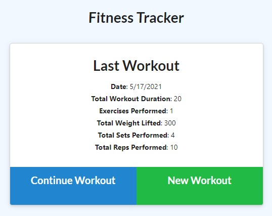
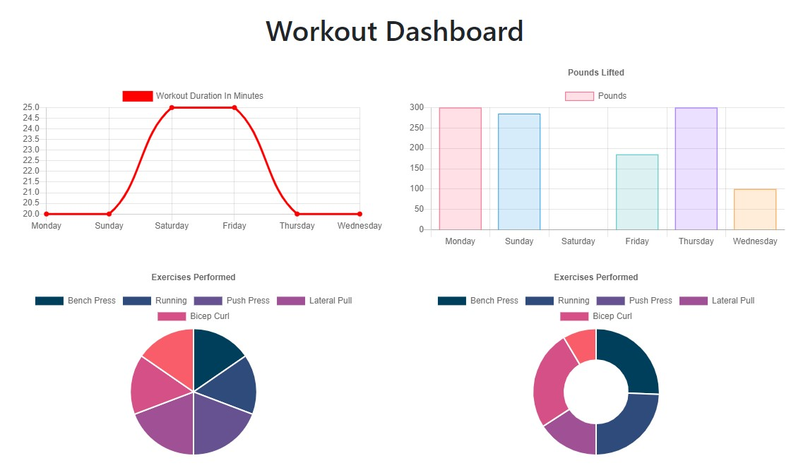

# Workout Tracker

## Description

This is a web application for keeping track of workout routines, and gives you a data visualization of the past 7 days that a user logs their workouts. This makes use of Node.js, Express and MongoDB as the stack. A deployed version can be found [here](https://tranquil-anchorage-14495.herokuapp.com/).

## Installation

To install this for local testing:

1. Make sure you have [node.js](https://nodejs.dev/) installed on your local machine.
2. Then clone or download the repository. Navigate to the root directory of the copy in your CLI and run the following to install all required dependencies:
```
    npm install
```
3. You will need to have a MongoDB server installed on your local machine to access the data. You can install the community version [here](https://www.mongodb.com/try/download/community).
4. Once you have MongoDB set up, run the following command in your CLI to create seed data:
```
    npm run seed
```
5. Finally, run the following to start the server on localhost 3000:
```
    npm start
```

## Usage

* Click "New Workout" to start a new workout session, and it will prompt you for your exercise details.
* If you want to continue adding exercises to a current workout, click "Continue Workout".
* A workout is completed either by clicking "Complete Workout", or by creating a new workout.
* To view a data visualization of your past 7 workouts, click on "Dashboard" in the navbar.
* To return to the main main, click "Fitness Tracker" in the navbar.

## Image Gallery

### Main


### Dashboard
